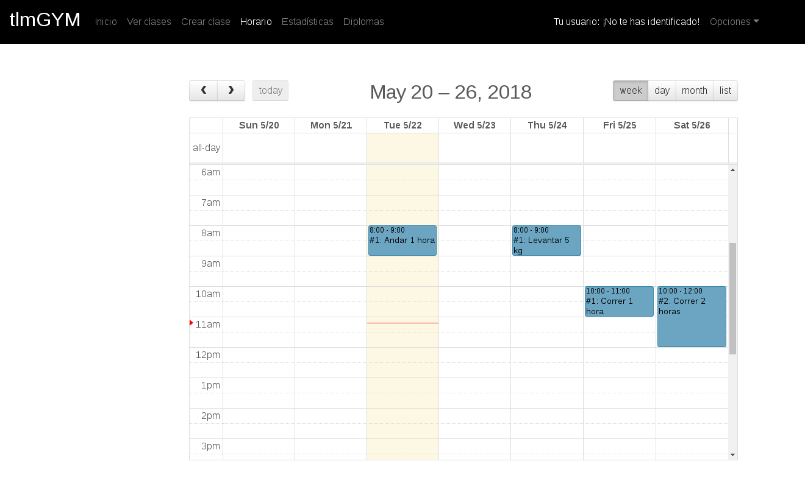

# Calendario de Clases
Web para la gestión de **Clases** (horario, alumnos) mediante una interfaz intuitiva con un **Calendario** como elemento central. Este sistema está enfocado para organizaciones como academias, empresas, etc.  
Como ejemplo, el sistema se ha adaptado a un **gimnasio**.  
Proyecto para las asignaturas "Servicios Web: Servidor" y "Servicios Web: Cliente".

## Screenshots

#### 1

---
#### 2

---
#### 3

---
#### 4

---
#### 5

---
#### 6
